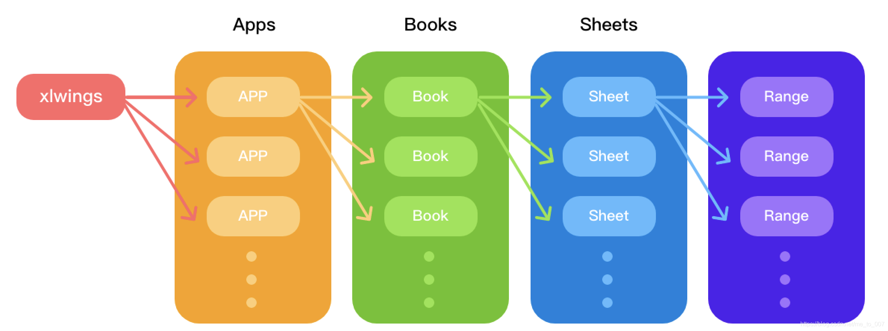

## xlwings

注意：电脑必须安装 execl 客户端，才可以操作表格。

### 安装&运行


### xlwings 对象结构

> xlwings — apps(App) — books（Book）— sheets（Sheet）— Range 模块 — 应用 — 工作簿 — 工作表 — 单元格



```python
import xlwings as xw
import pandas as pd


# xlwings
# 对象模型
# app->book->sheet->range

def hello_xw():
    # 获取 xlwings 应用实例
    app = xw.App(visible=True, add_book=False)
    # 添加一个工作簿
    workbook = app.books.add()
    # 获取工作簿中的工作表
    sheet = workbook.sheets[0]
    # 获取 “范围”
    df = pd.DataFrame(columns=['one', 'two'], data=[[1, 2], [3, 4]])
    sheet.range('A1').value = df
    # 保存 excel
    workbook.save('test.xlsx')
    # 退出工作簿
    workbook.close()
    # 退出应用
    app.quit()

# Press the green button in the gutter to run the script.
if __name__ == '__main__':
    hello_xw()
```

## 信息参考

1. [Pandas](https://www.pypandas.cn/get_pandas/#%E7%A8%B3%E5%AE%9A%E5%8F%91%E8%A1%8C%E7%89%88)
2. [xlwings 操作指南](https://www.pythonf.cn/read/69210)